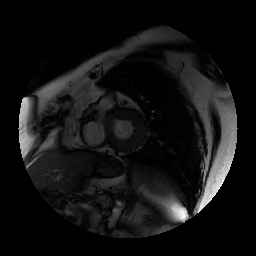
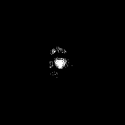
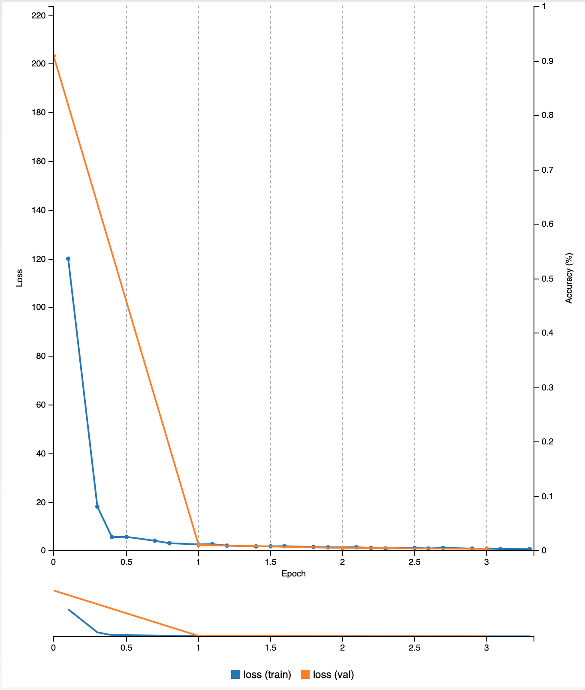

# Medical Image Segmentation using UNet
## Introduction

## Result
## Segmented Image
 
## Statistics

Due to the lack of computing resources, I cannot make it learn more than 3 epochs but it seems ok.
